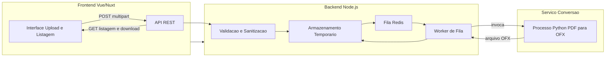

# Plano de Desenvolvimento: Sistema de Conversao de Extratos PDF para OFX

Este documento descreve o plano completo, sequencial e passo a passo, para o desenvolvimento do sistema de conversao de extratos bancarios em PDF para o formato OFX. Inclui definicao de arquitetura, stack tecnica, seguranca, limites de upload, processamento sincrono e assincrono, testes, ambientes e estrategias de deploy e monitoramento.

## Indice das etapas (documentos separados)

Cada topico de 1 a 12 possui um arquivo Markdown proprio com o conteudo detalhado e fases de desenvolvimento etapa por etapa:

| Etapa | Arquivo | Conteudo |
|-------|---------|----------|
| 1 | [etapa-01-visao-geral-escopo.md](etapa-01-visao-geral-escopo.md) | Visao geral e escopo |
| 2 | [etapa-02-arquitetura.md](etapa-02-arquitetura.md) | Arquitetura do sistema |
| 3 | [etapa-03-limites-desempenho.md](etapa-03-limites-desempenho.md) | Limites e desempenho |
| 4 | [etapa-04-fluxo-dados-comunicacao.md](etapa-04-fluxo-dados-comunicacao.md) | Fluxo de dados e comunicacao |
| 5 | [etapa-05-seguranca.md](etapa-05-seguranca.md) | Seguranca |
| 6 | [etapa-06-stack-dependencias.md](etapa-06-stack-dependencias.md) | Stack e dependencias |
| 7 | [etapa-07-ambientes.md](etapa-07-ambientes.md) | Ambientes (dev, homolog, prod) |
| 8 | [etapa-08-erros-resiliencia.md](etapa-08-erros-resiliencia.md) | Tratamento de erros e resiliencia |
| 9 | [etapa-09-testes.md](etapa-09-testes.md) | Testes |
| 10 | [etapa-10-performance-monitoramento.md](etapa-10-performance-monitoramento.md) | Performance e monitoramento |
| 11 | [etapa-11-cronograma.md](etapa-11-cronograma.md) | Cronograma sugerido |
| 12 | [etapa-12-escalabilidade-melhorias.md](etapa-12-escalabilidade-melhorias.md) | Escalabilidade futura e melhorias |

---

## 1. Visao geral e escopo

### 1.1 Objetivo do sistema

O sistema tem como objetivo receber extratos bancarios no formato PDF, processa-los e disponibilizar o resultado no formato OFX (Open Financial Exchange), amplamente utilizado por aplicativos de controle financeiro e contabilidade. A conversao deve ser confiavel, segura e oferecer uma experiencia de uso simples e objetiva.

### 1.2 Escopo funcional

- **Upload de arquivos PDF**: interface com campo de upload (drag-and-drop ou seletor de arquivos) para um ou mais extratos em PDF.
- **Processamento**: conversao do conteudo do PDF em transacoes estruturadas e geracao do arquivo OFX correspondente.
- **Listagem**: area na interface que exibe os arquivos OFX gerados (por job ou por sessao), com status do processamento (pendente, processando, concluido, erro).
- **Download**: link ou botao para download do arquivo OFX gerado, com validacao de acesso e expiracao.

Fora do escopo inicial: autenticacao de usuarios persistentes, multiplos bancos/layouts no mesmo MVP (pode ser um unico layout piloto), e integracao direta com sistemas contabeis.

### 1.3 Premissas

- Interface extremamente simples e objetiva: um campo de upload e uma area de listagem/download, priorizando usabilidade, clareza visual e fluidez.
- Seguranca e requisito nao negociavel: validacao e sanitizacao de entradas, protecao contra uploads maliciosos, limites de tamanho e boas praticas de armazenamento temporario.
- Uso de tecnologias definidas: frontend em TypeScript com Vue/Nuxt e Bootstrap; backend em Node.js; utilizacao de bibliotecas especializadas em Python para o processamento e conversao dos arquivos quando necessario.

### 1.4 Restricoes tecnicas

- **Frontend**: Vue 3 com Nuxt 3, TypeScript, Bootstrap 5.
- **Backend**: Node.js (versao LTS, recomendado 20+).
- **Conversao**: Python para leitura de PDF e geracao OFX (pdfplumber, PyMuPDF ou equivalente; geracao OFX via template ou biblioteca dedicada).

---

## 2. Arquitetura do sistema

### 2.1 Visao geral dos componentes

O sistema e composto por tres blocos principais: o frontend (aplicacao web), o backend (API em Node.js) e o servico de conversao (processo ou servico em Python). O backend orquestra o fluxo: recebe o upload, valida, armazena temporariamente, enfileira o trabalho (ou processa de forma sincrona quando aplicavel) e expoe o resultado para download.

### 2.2 Diagrama de comunicacao

O fluxo abaixo ilustra a comunicacao entre frontend, backend e servico de conversao, incluindo o enfileiramento assincrono e o retorno do OFX.

Fluxo sequencial resumido:

1. Usuario envia PDF pelo frontend para a API.
2. API valida, grava em disco temporario e enfileira job (ou processa sincrono para arquivos pequenos).
3. Worker consome o job, invoca o processo Python com o caminho do PDF.
4. Python le o PDF, extrai transacoes, gera OFX e grava em arquivo; worker atualiza status e associa o OFX ao job.
5. Frontend consulta listagem/status e baixa o OFX via endpoint de download.

### 2.3 Componentes em detalhe

**Frontend (Vue 3 + Nuxt 3 + TypeScript + Bootstrap 5)**

- Responsavel pela interface do usuario: tela de upload (campo unico, possivel multiplos arquivos ou um por vez) e area de listagem dos jobs/arquivos OFX com opcao de download.
- Comunica-se com o backend exclusivamente via API REST (HTTPS em producao). Pode usar polling para atualizar status dos jobs (pendente, processando, concluido, erro) ou, em evolucao futura, WebSocket.
- Validacao inicial no cliente: tipo de arquivo (PDF), tamanho maximo configurado, para melhor feedback imediato; a validacao definitiva ocorre no backend.

**Backend API (Node.js)**

- Responsavel por: receber uploads (multipart), validar e sanitizar arquivos, gravar em armazenamento temporario com nomes unicos (UUID), enfileirar jobs ou processar de forma sincrona, invocar o conversor Python (via child_process ou chamada HTTP interna), associar o OFX gerado ao job e expor endpoints de listagem e download.
- Opcionalmente: autenticacao e autorizacao, rate limiting por IP ou por usuario. Nao expoe caminhos internos do sistema de arquivos; downloads sao feitos por ID de recurso e, quando aplicavel, token efemero.

**Servico de conversao (Python)**

- Implementado como script ou modulo Python invocado pelo Node (ex.: `child_process.spawn`) ou como microsservico HTTP interno. Utiliza bibliotecas para leitura de PDF (pdfplumber, PyMuPDF ou similar) e para geracao do OFX (template manual ou biblioteca OFX).
- Recebe o caminho do arquivo PDF (ou o conteudo em cenarios controlados), extrai transacoes conforme o layout do extrato suportado e gera o arquivo OFX no formato esperado. Retorna sucesso/erro e o caminho do OFX gerado (ou buffer) para o backend.

### 2.4 Processamento sincrono versus assincrono

**Recomendacao: processamento assincrono com fila para a maioria dos casos.**

- **Assincrono com fila (Bull/BullMQ + Redis)**:
  - Usar para todos os uploads ou para arquivos acima de um limite (ex.: 2 MB). O request de upload retorna rapidamente com um identificador de job; o cliente consulta o status (polling ou WebSocket) e, quando concluido, acessa o link de download.
  - Vantagens: API nao bloqueia, permite retry em caso de falha, melhor controle de carga e tempo maximo de processamento por job.
  - Estados do job: `pending`, `processing`, `completed`, `failed`.

- **Processamento sincrono (opcional)**:
  - Considerar apenas para arquivos muito pequenos (ex.: ate 1 MB) e quando o tempo esperado de conversao for curto (ex.: menos de 10 segundos). O endpoint de upload aguarda a conversao e retorna o ID do recurso ou o arquivo no corpo da resposta, conforme contrato.
  - Implementar timeout (ex.: 15 s); em caso de timeout, enfileirar o job e retornar resposta indicando processamento assincrono (status e link para consulta).

### 2.5 Armazenamento temporario

- **Local**: diretorio temporario no servidor (ou volume montado), com nomes unicos (UUID) para arquivos PDF e OFX. Nenhum caminho absoluto ou nome interno deve ser exposto ao cliente.
- **Limpeza**: remover arquivos com mais de 24 horas (valor configuravel) via job agendado (cron ou scheduler da fila). Remover tambem arquivos associados a jobs finalizados (sucesso ou falha) apos um periodo curto (ex.: 1 hora) apos conclusao, para liberar espaco. Manter politica documentada e testada.

---

## 3. Limites de tamanho e desempenho

### 3.1 Limite ideal de upload (MB)

- **Valor recomendado para producao: 15 a 20 MB por arquivo.** Este valor equilibra extratos bancarios extensos (incluindo anuais, que podem chegar a 10 a 15 MB em PDF) com estabilidade de memoria, tempo de processamento e requisitos de infraestrutura.
- **Configuracao**: definir variavel de ambiente (ex.: `MAX_UPLOAD_MB=20`) e aplicar no backend e, se houver, no proxy reverso (Nginx). Em desenvolvimento e homologacao, pode-se usar o mesmo valor ou um limite menor para testes.
- **Acima do limite**: rejeitar o upload com codigo HTTP 413 (Payload Too Large) e mensagem clara. Opcoes futuras: suporte a compressao do PDF pelo cliente ou divisao em multiplos arquivos (mais de um extrato).

### 3.2 Estrategias complementares

- **Fila de processamento**: garantir que o processamento pesado nao ocorra no ciclo do request de upload. Jobs assincronos permitem retry com backoff e limite de tentativas.
- **Streaming**: ao receber o upload, gravar em disco em stream (chunks) quando possivel, evitando carregar o arquivo inteiro em memoria no Node. O Python pode ler o PDF por caminho de arquivo.
- **Compressao**: nao obrigatoria no MVP. Em evolucao, pode-se considerar compressao no transporte (gzip) ou armazenamento temporario comprimido, com custo adicional de implementacao e testes.
- **Limpeza automatica**: job periodico (diario ou a cada N horas) para excluir arquivos temporarios antigos e registros de jobs expirados, mantendo o disco e a base de controle previsiveis.
- **Escalabilidade**: API stateless; fila centralizada em Redis; worker(s) podem ser escalados horizontalmente; no futuro, o conversor Python pode ser um servico HTTP independente com multiplas instancias.

---

## 4. Fluxo de dados e comunicacao

### 4.1 Passo a passo do fluxo

1. **Usuario seleciona o PDF no frontend.** O cliente valida tipo (PDF) e tamanho (ate o limite em MB configurado) no navegador e exibe feedback imediato em caso de erro.
2. **Frontend envia o arquivo** via `POST` multipart para o endpoint do backend (ex.: `POST /api/upload`). Incluir nome original do arquivo apenas para exibicao; o backend nao confia nesse valor para decisões de seguranca.
3. **Backend valida** Content-Type, extensao (.pdf), tamanho e assinatura (magic bytes `%PDF-`). Rejeita com 400/422 se invalido. Sanitiza o nome do arquivo (sem path traversal, caracteres especiais).
4. **Backend grava** o arquivo em disco temporario com nome unico (UUID) e enfileira um job (ou inicia processamento sincrono se politicas assim definirem).
5. **Worker** (processo Node que consome a fila) obtem o job, invoca o conversor Python passando o caminho do PDF. O Python le o PDF, extrai transacoes, gera o OFX e grava em arquivo. O worker atualiza o status do job e associa o caminho do OFX (ou move para local padrao com ID do job).
6. **Backend expoe** o download (ex.: `GET /api/files/:id/download` ou `/api/jobs/:id/download`) com verificacao de existencia do arquivo e, se necessario, token efemero ou sessao. Nao expor caminhos internos.
7. **Frontend** lista jobs/arquivos (ex.: `GET /api/jobs` ou `/api/files`) e exibe link de download para jobs com status concluido. Apos expiracao ou politica de limpeza, arquivos sao removidos.

### 4.2 Contrato da API (resumo)

| Endpoint | Metodo | Descricao | Respostas principais |
|----------|--------|------------|----------------------|
| `/api/upload` | POST | Upload de PDF (multipart) | 200/201 (jobId), 400 (invalido), 413 (tamanho), 422 (validacao) |
| `/api/jobs` | GET | Listagem de jobs do usuario/sessao | 200 (lista de jobs com status e links) |
| `/api/jobs/:id` | GET | Status e detalhes de um job | 200 (status, progresso, link download se concluido), 404 |
| `/api/jobs/:id/download` | GET | Download do arquivo OFX | 200 (attachment), 404, 410 (expirado) |

Respostas de erro em JSON com codigo e mensagem generica; detalhes tecnicos apenas em logs. Autenticacao e autorizacao (se aplicavel) via header ou cookie, documentados separadamente.

---

## 5. Seguranca

### 5.1 Validacao e sanitizacao

- **Backend**: validar Content-Type (esperado para PDF), extensao permitida (.pdf), tamanho maximo em bytes e magic bytes (primeiros bytes do arquivo devem indicar PDF). Rejeitar qualquer arquivo que nao seja PDF valido; nao confiar apenas na extensao ou no nome enviado pelo cliente.
- **Nome do arquivo**: sanitizar para evitar path traversal (../) e caracteres especiais; usar apenas o nome para exibicao e armazenar o arquivo com UUID. Nunca usar entrada do usuario para construir caminhos no sistema de arquivos.

### 5.2 Protecao contra uploads maliciosos

- **Limite rigido de tamanho**: aplicar no backend e, se possivel, no proxy (Nginx) para evitar consumo excessivo de rede e disco.
- **Tempo maximo de processamento**: configurar timeout por job (ex.: 5 minutos); encerrar processo Python se exceder.
- **Ambiente controlado**: o conversor Python nao deve executar codigo arbitrario derivado do conteudo do PDF (sem eval/exec de dados do arquivo). Usar apenas bibliotecas seguras de leitura de PDF.
- **PDF bomb**: considerar validacao adicional (ex.: numero maximo de paginas ou de objetos) para detectar arquivos construidos para consumir recursos; rejeitar ou limitar com mensagem adequada.

### 5.3 Boas praticas

- Nao expor caminhos internos do servidor em respostas ou logs.
- Download com identificador opaco (ID) e, se necessario, token de uso unico ou de curta expiracao.
- Logs sem dados sensiveis (conteudo do extrato, dados pessoais); registrar apenas IDs, tamanhos, status e duracao.
- Rate limiting no endpoint de upload por IP e, se houver autenticacao, por usuario, para mitigar abuso.

---

## 6. Stack tecnica e dependencias

### 6.1 Frontend

- Vue 3, Nuxt 3, TypeScript.
- Bootstrap 5 para layout e componentes (interface simples: upload + listagem/download).
- Cliente HTTP: ofetch (Nuxt) ou axios para chamadas à API.
- Validacao de arquivo no cliente: tipo MIME e tamanho antes do envio.

### 6.2 Backend

- Node.js 20 LTS ou superior.
- Framework: Express ou Fastify.
- Upload multipart: multer ou equivalente (Fastify multipart).
- Fila: Bull ou BullMQ com Redis.
- Invocacao do Python: modulo `child_process` (spawn) ou cliente HTTP se o conversor for exposto como API interna.
- Variaveis de ambiente: `MAX_UPLOAD_MB`, `REDIS_URL`, `TEMP_DIR`, `CLEANUP_AGE_HOURS`, etc.

### 6.3 Servico de conversao (Python)

- Python 3.11 ou superior.
- Leitura de PDF: pdfplumber ou PyMuPDF (pymupdf).
- Geracao OFX: template manual (strings/arquivo) ou biblioteca OFX disponivel na comunidade.
- Ambiente virtual (venv) e `requirements.txt` com versoes fixas para reprodutibilidade.

### 6.4 Infraestrutura

- Redis para a fila de jobs (obrigatorio no modelo assincrono).
- Proxy reverso (Nginx ou similar) opcional: terminar TLS, limitar tamanho do body (`client_max_body_size`) e rotear para a API.
- Armazenamento: disco local ou volume persistente para arquivos temporarios; politica de limpeza obrigatoria.

---

## 7. Ambientes: desenvolvimento, homologacao e producao

### 7.1 Desenvolvimento

- Variaveis de ambiente documentadas em `.env.example` (sem segredos reais). Cada desenvolvedor copia para `.env` e preenche valores locais.
- Backend e frontend rodando em maquina local (ou containers). Redis local ou via Docker. Python em venv no projeto do conversor.
- Limite de upload e timeouts podem ser iguais ou menores que producao para facilitar testes. Logs em nivel debug quando necessario.

### 7.2 Homologacao

- Ambiente o mais proximo possivel de producao: mesmo limite de upload, timeouts, uso de fila e Redis. Dados de teste; sem dados reais de usuarios.
- Execucao de testes E2E contra a API e o frontend (upload, consulta de status, download). Validar tambem cenarios de erro (arquivo grande, PDF invalido, timeout).

### 7.3 Producao

- HTTPS obrigatorio. Variaveis de ambiente carregadas de forma segura (gerenciador de segredos ou env do ambiente).
- Logs estruturados (JSON ou padrao definido), sem dados sensiveis. Health checks para a API (`/health`) e para dependencias (Redis). Limite de upload e timeouts configurados conforme secao 3. Política de limpeza de arquivos temporarios ativa e monitorada.

---

## 8. Tratamento de erros e resiliencia

### 8.1 Categorias de erro

- **Arquivo invalido**: tipo/conteudo nao PDF, extensao incorreta. Resposta 400 ou 422 com mensagem generica.
- **Tamanho excedido**: 413 Payload Too Large.
- **Falha na conversao**: PDF corrompido ou layout nao suportado. Job marcado como `failed`; resposta na listagem/status com indicacao de erro; mensagem generica ao usuario; detalhes em log.
- **Timeout**: processo Python ou request excede tempo limite. Job pode ser reenfileirado (retry) ou marcado como falha apos N tentativas.
- **Falha de fila/Redis**: API deve retornar 503 ou colocar upload em modo degradado (ex.: apenas sincrono com limite menor). Log e alerta para recuperacao do Redis.

### 8.2 Respostas HTTP e mensagens

- Usar codigos consistentes: 400 (requisicao invalida), 413 (tamanho), 422 (validacao), 500 (erro interno), 503 (servico indisponivel). Resposta em JSON com `code` e `message`; mensagem amigavel ao usuario, sem detalhes internos.
- Detalhes tecnicos (stack, caminhos) apenas em logs do servidor.

### 8.3 Retry e dead-letter

- Jobs na fila: retry com backoff exponencial e numero maximo de tentativas (ex.: 3). Apos esgotar, marcar como `failed` (ou enviar para fila dead-letter para analise). Opcional: notificacao ou log agregado para falhas recorrentes (alerta operacional).

---

## 9. Testes

### 9.1 Frontend

- Testes unitarios para componentes de upload (validacao de tipo e tamanho no cliente) e de listagem (exibicao de status e link de download). Ambiente de testes com mocks da API.

### 9.2 Backend

- Testes unitarios: validadores (magic bytes, extensao, tamanho, sanitizacao de nome), orquestracao (gravacao em disco, enfileiramento). Mock do conversor Python (arquivo fixo ou stub).
- Testes de integracao: upload real para endpoint, gravacao em disco, insercao na fila; consumo do job com mock do Python e verificacao de status e arquivo OFX gerado.

### 9.3 Conversor Python

- Testes unitarios: extracao de texto/dados de PDFs de exemplo (anonimizados) e geracao do OFX. Casos de PDF corrompido ou formato inesperado devem falhar de forma controlada e reportar erro claro.

### 9.4 Testes E2E

- Fluxo completo em ambiente de homologacao: upload de PDF valido, aguardar processamento (polling), download do OFX e validacao basica do conteudo. Cenarios de erro: arquivo acima do limite, arquivo que nao e PDF, timeout (se aplicavel).

---

## 10. Criterios de performance e monitoramento

### 10.1 Performance

- **Upload**: tempo de resposta da API de upload (ate confirmacao e retorno do jobId) inferior a 2 segundos em condicoes normais, sem incluir o tempo de conversao no request.
- **Conversao**: meta de otimizacao de tempo de processamento por pagina de PDF (ex.: ate 3 segundos por pagina), a ser medida e refinada com amostras reais.

### 10.2 Monitoramento

- **Health check**: endpoint `/health` que verifica a API e a conexao com Redis; usado por load balancer e ferramentas de monitoramento.
- **Metricas**: tamanho da fila (pending/active), quantidade de jobs concluidos e falhos por periodo; duracao media dos jobs. Logs de erro e duracao por job para analise.
- **Alertas**: disparar alertas para fila crescendo sem consumo, Redis indisponivel, ou taxa de falha anormal em jobs.

---

## 11. Cronograma sugerido (etapas sequenciais)

1. **Configuracao do repositorio e ambientes**: estrutura de pastas (frontend, backend, conversor Python), arquivos de dependencias (package.json, requirements.txt), `.env.example`, e documentacao minima para rodar em desenvolvimento (README).
2. **Definicao da API e contrato**: especificar endpoints (upload, listagem, status, download), formatos de request/response e formato de dados entre backend e Python (caminhos, codigos de saida).
3. **Implementacao do servico de conversao em Python**: leitura de PDF com biblioteca escolhida, extracao de transacoes para um layout piloto, geracao do OFX e testes unitarios com amostras.
4. **Implementacao do backend**: endpoints de upload com validacao e sanitizacao, gravacao em disco temporario, integracao com fila Redis, worker que invoca o Python e atualiza status; endpoints de listagem e download.
5. **Implementacao do frontend**: tela de upload (campo unico, feedback de progresso/erro) e area de listagem com status e download; integracao com a API (ofetch/axios).
6. **Politicas de limpeza e seguranca**: job agendado de limpeza de arquivos temporarios, reforco de limites de tamanho e validacoes, rate limiting e revisao de logs.
7. **Testes de integracao e E2E**: cobertura dos fluxos principais e de erro; ajustes de performance conforme metricas.
8. **Documentacao de deploy e monitoramento**: passos para deploy em homologacao e producao (env, Nginx, Redis, workers), health checks e alertas.
9. **Deploy**: homologacao primeiro; validacao; deploy em producao com rollback planejado.

---

## 12. Escalabilidade futura e melhorias

- **Conversor como servico HTTP**: expor o conversor Python como API REST interna, permitindo multiplas instancias atras de um balanceador e escalonamento independente.
- **Cache por hash do PDF**: armazenar resultado OFX indexado por hash do PDF (e opcionalmente parametros) para evitar reprocessamento identico; TTL e politica de invalidade definidos.
- **Multiplos layouts de extrato**: suporte a mais de um banco ou formato de PDF via perfis de conversao ou deteccao automatica do layout, com testes por perfil.
- **Auditoria**: registro de acessos e conversoes (quem, quando, qual recurso) para conformidade e suporte, sem armazenar conteudo sensivel nos logs.

---

## Conclusao

Este plano cobre a definicao de arquitetura, comunicacao entre frontend (Vue/Nuxt + Bootstrap), backend (Node.js) e servico de conversao (Python), estrategias de processamento assincrono com fila, limites de upload (15 a 20 MB recomendados), validacao e seguranca, armazenamento temporario e limpeza, testes, ambientes e deploy. Seguindo as etapas de forma sequencial e aplicando as boas praticas descritas, o sistema tende a ser robusto, seguro e preparado para uso real, com espaco para evolucao em desempenho e funcionalidade.
