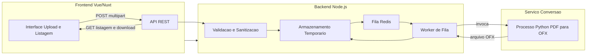

# Etapa 2: Arquitetura do sistema

Este documento detalha a arquitetura do sistema: componentes (frontend, backend, servico de conversao), diagrama de comunicacao, processamento sincrono versus assincrono e armazenamento temporario.

---

## 2.1 Visao geral dos componentes

O sistema e composto por tres blocos principais: o frontend (aplicacao web), o backend (API em Node.js) e o servico de conversao (processo ou servico em Python). O backend orquestra o fluxo: recebe o upload, valida, armazena temporariamente, enfileira o trabalho (ou processa de forma sincrona quando aplicavel) e expoe o resultado para download.

---

## 2.2 Diagrama de comunicacao

O fluxo abaixo ilustra a comunicacao entre frontend, backend e servico de conversao, incluindo o enfileiramento assincrono e o retorno do OFX.

Fluxo sequencial resumido:

1. Usuario envia PDF pelo frontend para a API.
2. API valida, grava em disco temporario e enfileira job (ou processa sincrono para arquivos pequenos).
3. Worker consome o job, invoca o processo Python com o caminho do PDF.
4. Python le o PDF, extrai transacoes, gera OFX e grava em arquivo; worker atualiza status e associa o OFX ao job.
5. Frontend consulta listagem/status e baixa o OFX via endpoint de download.

---

## 2.3 Componentes em detalhe

**Frontend (Vue 3 + Nuxt 3 + TypeScript + Bootstrap 5)**

- Responsavel pela interface do usuario: tela de upload (campo unico, possivel multiplos arquivos ou um por vez) e area de listagem dos jobs/arquivos OFX com opcao de download.
- Comunica-se com o backend exclusivamente via API REST (HTTPS em producao). Pode usar polling para atualizar status dos jobs (pendente, processando, concluido, erro) ou, em evolucao futura, WebSocket.
- Validacao inicial no cliente: tipo de arquivo (PDF), tamanho maximo configurado, para melhor feedback imediato; a validacao definitiva ocorre no backend.

**Backend API (Node.js)**

- Responsavel por: receber uploads (multipart), validar e sanitizar arquivos, gravar em armazenamento temporario com nomes unicos (UUID), enfileirar jobs ou processar de forma sincrona, invocar o conversor Python (via child_process ou chamada HTTP interna), associar o OFX gerado ao job e expor endpoints de listagem e download.
- Opcionalmente: autenticacao e autorizacao, rate limiting por IP ou por usuario. Nao expoe caminhos internos do sistema de arquivos; downloads sao feitos por ID de recurso e, quando aplicavel, token efemero.

**Servico de conversao (Python)**

- Implementado como script ou modulo Python invocado pelo Node (ex.: `child_process.spawn`) ou como microsservico HTTP interno. Utiliza bibliotecas para leitura de PDF (pdfplumber, PyMuPDF ou similar) e para geracao do OFX (template manual ou biblioteca OFX).
- Recebe o caminho do arquivo PDF (ou o conteudo em cenarios controlados), extrai transacoes conforme o layout do extrato suportado e gera o arquivo OFX no formato esperado. Retorna sucesso/erro e o caminho do OFX gerado (ou buffer) para o backend.

---

## 2.4 Processamento sincrono versus assincrono

**Recomendacao: processamento assincrono com fila para a maioria dos casos.**

- **Assincrono com fila (Bull/BullMQ + Redis)**:
  - Usar para todos os uploads ou para arquivos acima de um limite (ex.: 2 MB). O request de upload retorna rapidamente com um identificador de job; o cliente consulta o status (polling ou WebSocket) e, quando concluido, acessa o link de download.
  - Vantagens: API nao bloqueia, permite retry em caso de falha, melhor controle de carga e tempo maximo de processamento por job.
  - Estados do job: `pending`, `processing`, `completed`, `failed`.

- **Processamento sincrono (opcional)**:
  - Considerar apenas para arquivos muito pequenos (ex.: ate 1 MB) e quando o tempo esperado de conversao for curto (ex.: menos de 10 segundos). O endpoint de upload aguarda a conversao e retorna o ID do recurso ou o arquivo no corpo da resposta, conforme contrato.
  - Implementar timeout (ex.: 15 s); em caso de timeout, enfileirar o job e retornar resposta indicando processamento assincrono (status e link para consulta).

---

## 2.5 Armazenamento temporario

- **Local**: diretorio temporario no servidor (ou volume montado), com nomes unicos (UUID) para arquivos PDF e OFX. Nenhum caminho absoluto ou nome interno deve ser exposto ao cliente.
- **Limpeza**: remover arquivos com mais de 24 horas (valor configuravel) via job agendado (cron ou scheduler da fila). Remover tambem arquivos associados a jobs finalizados (sucesso ou falha) apos um periodo curto (ex.: 1 hora) apos conclusao, para liberar espaco. Manter politica documentada e testada.

---

## Fases de desenvolvimento (Etapa 2)

| Fase | Descricao | Entregavel |
|------|-----------|------------|
| 2.1 | Definir e desenhar os tres blocos (frontend, backend, conversao) e responsabilidades | Diagrama de componentes e texto de arquitetura |
| 2.2 | Especificar fluxo de dados (upload, fila, worker, download) e diagrama Mermaid | Diagrama de comunicacao aprovado |
| 2.3 | Detalhar frontend: telas (upload, listagem), validacao no cliente, integracao com API | Especificacao do frontend |
| 2.4 | Detalhar backend: endpoints, validacao, disco, fila, invocacao Python, listagem e download | Especificacao do backend |
| 2.5 | Detalhar servico Python: entrada (caminho PDF), saida (OFX), bibliotecas | Especificacao do conversor |
| 2.6 | Decidir modelo sincrono/assincrono e limites (tamanho, timeout); documentar estados do job | Decisao de processamento documentada |
| 2.7 | Definir politica de armazenamento temporario (UUID, limpeza em 24h e apos conclusao) | Politica de armazenamento e limpeza |
| 2.8 | Revisar esta etapa antes de iniciar a Etapa 3 (Limites e desempenho) | Checklist de conclusao da Etapa 2 |
